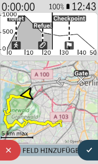
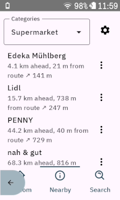
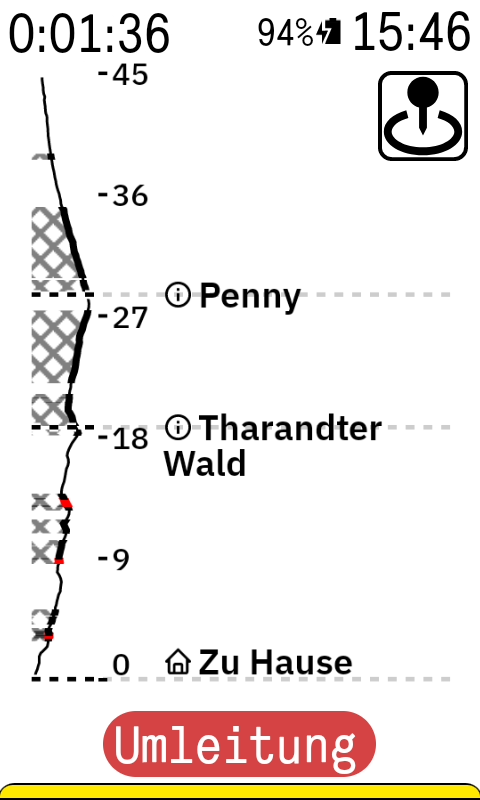
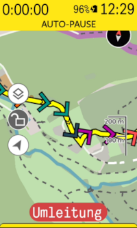

# Karoo Route Graph Extension

This extension for Karoo devices adds a graphical data field showing the elevation profile of the current route,
including route-specific POIs that you have set up, global POIs and climbs. It also provides a minimap datafield and
a button to navigate to POIs along the route (e. g. upcoming gas stations for refueling). It's meant to be used
as a companion app on long rides where you want to have a quick overview of the route that includes upcoming checkpoints,
climbs and refueling opportunities so that you can pace yourself accordingly.

Please note that an active internet connection is required to search for nearby POIs while riding.

Compatible with Karoo 2 and Karoo 3 devices.

## Installation

If you are using a Karoo 3, you can use [Hammerhead's sideloading procedure](https://support.hammerhead.io/hc/en-us/articles/31576497036827-Companion-App-Sideloading) to install the app:

1. Using the browser on your phone, long-press [this download link](https://github.com/timklge/karoo-routegraph/releases/latest/download/app-release.apk) and share it with the Hammerhead Companion app.
2. Your karoo should show an info screen about the app now. Press "Install".
3. Open the app from the main menu and acknowledge the API usage note.
4. Set up your data fields as desired.

If you are using a Karoo 2, you can use manual sideloading:

1. Download the apk from the [releases page](https://github.com/timklge/karoo-routegraph/releases) (or build it from source)
2. Set up your Karoo for sideloading. DC Rainmaker has a great [step-by-step guide](https://www.dcrainmaker.com/2021/02/how-to-sideload-android-apps-on-your-hammerhead-karoo-1-karoo-2.html).
3. Install the app by running `adb install app-release.apk`.
4. Open the app from the main menu and acknowledge the API usage note.
5. Set up your data fields as desired.

## Usage

After installing this app on your Karoo and opening it once from the main menu, you can add the following new data fields to your data pages:

- Minimap (see first screenshot): Shows a secondary map of the whole route, including climbs and POIs
- Route Graph (see second screenshot): Shows a graph of the current route, including POIs / checkpoints / refueling stops. This data field works just like the native
elevation profile data field of the Karoo, but adds markers for route-specific and global POIs and climbs. By touching the data field, you can cycle
between the full route and the upcoming 2km, 20km, 50km and 100km of the route.
- Vertical Route Graph (see third screenshot): Similar to the route graph, but flipped so that the vertical axis depicts the route distance. The name of POIs, the remaining distance and elevation
to them as well as climb lengths and total climb elevations are shown next to the elevation profile.
- POI Button: Shows a single button that opens a dialog with a list of all POIs along the route. You can tap on each POI to start navigation to it. In addition to the route-specific and global POIs set up on the Karoo, 
you can also look for nearby POIs of certain categories (e. g. cafes, restaurants etc.) using the Overpass API, or search for POIs by name using the Nominatim geocoding API.
By default, route graph datafields also feature a POI button in the top right corner.
- Distance to POI: Shows the distance to the next POI along the route. Note that this is the distance along the route and not the straight-line distance.
- Elevation to POI: Shows the remaining climbing to the next POI along the route. Note that this is the elevation along the route and not the straight-line elevation.

Additionally, you can enable chevrons on the map to indicate gradients. The chevrons are drawn on top of the route (see third screenshot). Find more information below.

## Features

### Elevation profile datafields

The main data fields provided by this extension are the horizontal and vertical route graph data fields. Both data fields show the elevation profile of the current route, similar to the native elevation profile data field.
The horizontal route graph shows distance on the horizontal axis and elevation on the vertical axis, while the vertical route graph shows elevation on the horizontal axis and distance on the vertical axis.
Both data fields show markers for route-specific POIs as well as global POIs and climbs.

By touching the data field, you can cycle between the full route and the upcoming 2km, 20km, 50km and 100km of the route. If you enable surface condition display in the settings menu,
offroad sections of the route will be highlighted in the route graph (see section below).

For high zoom levels (2 km), instead of climbs, each 100 meter segment of the route will be colored individually, as is done in the Karoo's climber drawer.

### Minimap

The minimap data field shows a secondary map of the whole route, including climbs and POIs. The current position is indicated by a yellow arrow.
You can zoom in by touching the data field. The minimap uses OpenStreetMap raster tiles served by https://tile.openstreetmap.org, so it requires an active internet connection to load the map tiles (provided by the companion app).
Downloaded tiles are cached on the Karoo for offline use.

### Surface Conditions

You can enable surface condition display on the route graph data fields in the settings menu. The extension will then use the maps downloaded on your Karoo to determine the surface type of each route segment
and highlight offroad segments (e. g. gravel, dirt roads) in the route graph. To do this, the extension will ask for permission to read the map files on your Karoo. Calculating the surface conditions
can take a few seconds when loading a route.

Gravel sections will be highlighted using a thick line and hatched fill pattern. Offroad sections (e. g. grass) will additionally be highlighted by a red outline.

### Gradient Indicators

You can enable gradient indicators (chevrons) on the map in the settings menu. The extension will then draw chevrons on top of the route on the main karoo map to indicate uphill and downhill sections.
Uphill chevrons use the known color scheme of the karoo (green-yellow-red for increasing gradients), downhill chevrons are shown in blue, with white / light blue for shallow descents and dark blue for steep descents.

### Adding POIs

During riding, you can open a POI managment menu by clicking the button shown in the top right corner of any routegraph elevation profile datafield. This will open a menu with three pages:

- On the *Custom* page, your global POIs and the POIs of the currently loaded route are shown, including distance to the POI. You can toggle the display to show the remaining distance and remaining elevation climbing along the route instead of straight-line distance.
- On the *Nearby* page, you can look up new POIs of selected categories near you (e. g. supermarkets, shelters, bike shops). This requires an active internet connection, which is provided by the Karoo companion app on your phone if you are using a Karoo 3.
- On the *Search* page, you can look up POIs by typing in a search query (e. g. "Brandenburg Gate" or a postal address). This also requires an active internet connection.

On all pages, you can use the dot menu for each POI to initiate navigation to that POI. For POIs looked up on the Nearby or Search pages, you can also choose to add that POI to the elevation profiles (and the main karoo map).

### Experimental: Traffic incidents

You can input a HERE Maps API key in the settings to enable traffic incident reporting. The extension will then
fetch traffic incidents along the route and display them on the minimap, the route graphs and the main karoo map.
You will also get a notification when loading a route if there are traffic incidents along the route.

## Credits

- OpenStreetMap Data © <a href="https://www.openstreetmap.org/copyright">OpenStreetMap</a> contributors (<a href="https://opendatacommons.org/licenses/odbl/index.html">ODbL</a>), <a href="https://creativecommons.org/licenses/by-sa/2.0/">CC-BY-SA</a>, <a href="https://openstreetmap.org/fixthemap">participate/fix mistakes</a>
  - OpenStreetMap raster tiles for the minimap served by https://tile.openstreetmap.org
  - Nearby POI search uses https://overpass-api.de
  - POI search box uses nominatim API for geocoding: https://nominatim.openstreetmap.org/
- Icons are from [boxicons.com](https://boxicons.com) ([MIT-licensed](icon_credits.txt))
- Uses [karoo-ext](https://github.com/hammerheadnav/karoo-ext) (Apache2-licensed)
- Uses Flexpolyline encoder / decoder by HERE Europe B. V. (MIT-licensed)
