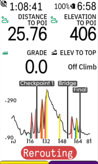
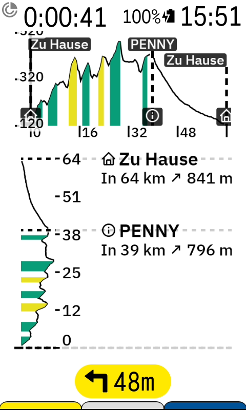
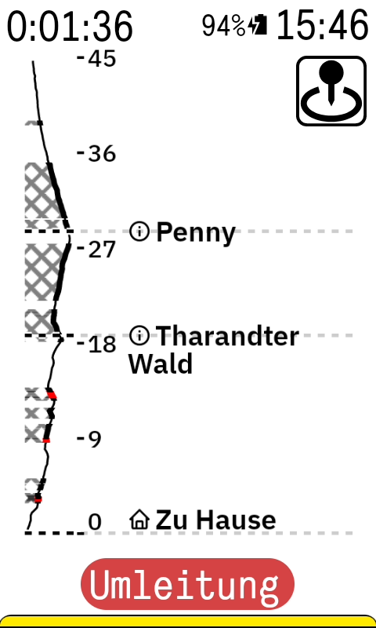
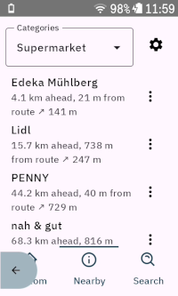

# Karoo Route Graph Extension

This extension for Karoo devices adds graphical data fields showing the elevation profile of the current route,
including route-specific POIs, climbs and surface conditions. It also provides a POI navigation feature to look up
upcoming POIs of certain categories along the route. It's meant to be used as a companion app on long rides where
you want to have a quick overview of the route that includes upcoming checkpoints, climbs and refueling opportunities
so that you can pace yourself accordingly.

Compatible with Karoo 2 and Karoo 3 devices.

## Installation

This extension is available from the extension library on your Karoo device. Find more information on extensions in the [Hammerhead FAQ](https://support.hammerhead.io/hc/en-us/articles/34676015530907-Karoo-OS-Extensions-Library).

## Usage

After installing this app on your Karoo and opening it once from the main menu, you can add the following new data fields to your data pages:

- **Route Graph**: Shows a graph of the current route, including POIs / checkpoints / refueling stops. This data field works just like the native
  elevation profile data field of the Karoo, but adds markers for route-specific and global POIs and climbs. By touching the data field, you can cycle
  between the full route and the upcoming 2km, 20km, 50km and 100km of the route.
- **Vertical Route Graph**: Similar to the route graph, but flipped so that the vertical axis depicts the route distance. The name of POIs, the remaining distance and elevation
  to them as well as climb lengths and total climb elevations are shown next to the elevation profile. Optionally shows ETA, remaining distance, and remaining elevation.
- **POI Button**: Shows a single button that opens a dialog with a list of all POIs along the route. You can tap on each POI to start navigation to it. In addition to the route-specific and global POIs set up on the Karoo,
  you can also look for nearby POIs of certain categories (e. g. cafes, restaurants etc.) using the Overpass API and downloaded POIs, or search for POIs by name using the Nominatim geocoding API.
  By default, route graph datafields also feature a POI button in the top right corner.
- **Distance to POI**: Shows the distance to the next POI along the route. Note that this is the distance along the route and not the straight-line distance.
- **Elevation to POI**: Shows the remaining climbing to the next POI along the route. Note that this is the elevation along the route and not the straight-line elevation.
- **ETA at POI**: Shows the estimated time of arrival at the next POI along the route. The ETA is calculated based on your average power output over the last hour. If you don't have a powermeter, this uses a rough approximation based on your speed and the route gradient.
- **ETA at end of route**: Shows the estimated time of arrival at the end of the route.
- **POIs Ahead**: Shows a list of the next POIs along the route with their distance.

## Features

### Elevation profile datafields

The main data fields provided by this extension are the horizontal and vertical route graph data fields. Both data fields show the elevation profile of the current route, similar to the native elevation profile data field.
The horizontal route graph shows distance on the horizontal axis and elevation on the vertical axis, while the vertical route graph shows elevation on the horizontal axis and distance on the vertical axis.
Both data fields show markers for route-specific POIs as well as global POIs and climbs.

By touching the data field, you can cycle between the full route and the upcoming 2km, 20km, 50km and 100km of the route. If you enable surface condition display in the settings menu,
offroad sections of the route will be highlighted in the route graph (see section below).

For high zoom levels (2 km), instead of climbs, each 100 meter segment of the route will be colored individually, as is done in the Karoo's climber drawer.

### Surface Conditions

You can enable surface condition display on the route graph data fields in the settings menu. The extension will then use the maps downloaded on your Karoo to determine the surface type of each route segment
and highlight offroad segments (e. g. gravel, dirt roads) in the route graph. To do this, the extension will ask for permission to read the map files on your Karoo. Calculating the surface conditions
can take a few seconds when loading a route.

Gravel sections will be highlighted using a thick line and hatched fill pattern. Offroad sections (e. g. grass) will additionally be highlighted by a red outline.

### POI Management

During riding, you can open a POI management menu by clicking the button shown in the top right corner of any routegraph elevation profile datafield. This will open a menu with three pages:

- On the *Custom* page, your global POIs and the POIs of the currently loaded route are shown, including distance to the POI. You can toggle the display to show the remaining distance and remaining elevation climbing along the route instead of straight-line distance.
- On the *Nearby* page, you can look up new POIs of selected categories near you (e. g. supermarkets, shelters, bike shops). You can download POIs for regions in the settings menu, so that you can look up POIs without an active internet connection during riding.
- On the *Search* page, you can look up POIs by typing in a search query (e. g. "Brandenburg Gate" or a postal address). This requires an active internet connection.

On all pages, you can use the dot menu for each POI to initiate navigation to that POI. For POIs looked up on the Nearby or Search pages, you can also choose to add that POI to the elevation profiles (and the main karoo map).

In the settings menu, you can also choose to automatically select POI categories that should automatically be added to the map and elevation profiles when loading up a route.

### POI Approach Alerts

You can enable POI approach alerts in the settings menu to receive notifications when approaching POIs of selected categories. The alerts show the POI name and distance, and indicate whether the POI is likely to be open or closed based on its opening hours.

### Offline POI Support

You can download POI data for offline use in the settings menu. This allows you to look up nearby POIs without an active internet connection during riding. POIs include categories such as:

- Water points, Restaurants, Cafes, Ice Cream shops
- Fast Food, Supermarkets, Convenience stores, Bakeries
- Gas stations, Camping sites, Attractions, Viewpoints
- Beaches, Swimming areas, Bike shops
- Pharmacies, Hospitals, Hotels, Shelters, Toilets, Bench, Town, Village, Train stations, Waste baskets

## Settings

In the settings menu you can configure:

- Zoom levels shown on elevation profiles (2km, 20km, 50km, 100km, full route)
- Whether to show navigate buttons on graphs
- Surface condition highlighting on/off
- Climb highlighting at specific zoom levels
- POI approach alert distance and categories
- Automatic POI category addition when loading routes
- Offline POI storage and download management

## Credits

- OpenStreetMap Data © <a href="https://www.openstreetmap.org/copyright">OpenStreetMap</a> contributors (<a href="https://opendatacommons.org/licenses/odbl/index.html">ODbL</a>), <a href="https://creativecommons.org/licenses/by-sa/2.0/">CC-BY-SA</a>, <a href="https://openstreetmap.org/fixthemap">participate/fix mistakes</a>
  - Nearby POI search uses https://overpass-api.de
  - POI search box uses nominatim API for geocoding: https://nominatim.openstreetmap.org/
  - Offline POIs are downloaded from https://routegraph.timklge.de
- Icons are from [boxicons.com](https://boxicons.com) ([MIT-licensed](icon_credits.txt))
- Uses [karoo-ext](https://github.com/hammerheadnav/karoo-ext) (Apache2-licensed)
- Uses Flexpolyline encoder / decoder by HERE Europe B. V. (MIT-licensed)
- Uses the [ANTLR grammar](https://github.com/opening-hours/opening_hours_grammar) for OSM opening hours definitions (MIT-licensed)