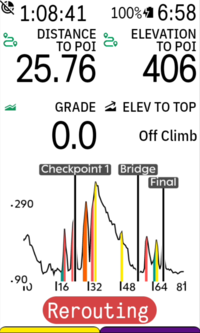

# Karoo Route Graph Extension

This extension for Karoo devices adds a graphical data field showing the elevation profile of the current route,
including route-specific POIs that you have set up, global POIs and climbs.

Please note that currently, this app requires an active internet connection to fetch elevation data, which
is downloaded from [valhalla1.openstreetmap.de](https://valhalla1.openstreetmap.de). This is a public API
hosted by FOSSGIS e. V. (Credits see below).

Compatible with Karoo 2 and Karoo 3 devices.

## Installation

If you are using a Karoo 3, you can use [Hammerhead's sideloading procedure](https://support.hammerhead.io/hc/en-us/articles/31576497036827-Companion-App-Sideloading) to install the app:

1. Using the browser on your phone, long-press [this download link](https://github.com/timklge/karoo-headwind/releases/latest/download/app-release.apk) and share it with the Hammerhead Companion app.
2. Your karoo should show an info screen about the app now. Press "Install".
3. Open the app from the main menu and acknowledge the API usage note.
4. Set up your data fields as desired.

If you are using a Karoo 2, you can use manual sideloading:

1. Download the apk from the [releases page](https://github.com/timklge/karoo-routegraph/releases) (or build it from source)
2. Set up your Karoo for sideloading. DC Rainmaker has a great [step-by-step guide](https://www.dcrainmaker.com/2021/02/how-to-sideload-android-apps-on-your-hammerhead-karoo-1-karoo-2.html).
3. Install the app by running `adb install app-release.apk`.
4. Open the app from the main menu and acknowledge the API usage note.
5. Set up your data fields as desired.

## Usage

After installing this app on your Karoo and opening it once from the main menu, you can add the following new data fields to your data pages:

- Route Graph (see first screenshot): Shows a graph of the current route, including POIs / checkpoints / refueling stops. This data field works just like the native
elevation profile data field of the Karoo, but adds markers for route-specific and global POIs and climbs. By touching the data field, you can cycle
between the full route and the upcoming 2km, 20km, 50km and 100km of the route.
- Vertical Route Graph (see second screenshot): Similar to the route graph, but flipped so that the vertical axis depicts the route distance. The name of POIs, the remaining distance and elevation
to them as well as climb lengths and total climb elevations are shown next to the elevation profile.
- Distance to POI: Shows the distance to the next POI along the route. Note that this is the distance along the route and not the straight-line distance.
- Elevation to POI: Shows the remaining climbing to the next POI along the route. Note that this is the elevation along the route and not the straight-line elevation.

## Open issues

- Because karoo extensions can currently not access the route elevation data directly, once you load a route, the extension will attempt 
to fetch the elevation profile from the Valhalla API hosted by FOSSGIS e. V. Your karoo thus needs an active internet connection.
- Because karoo extensions can currently not access the climb segments identified by the Karoo, the extension will
try to identify climbs using an alternate algorithm, so they will not perfectly match up with the Karoo Climber feature.
- "Show gradient indicators on the map" feature is not available yet.

## Credits

- Uses valhalla1.openstreetmap.de for elevation data (hosted by [FOSSGIS e.V.](https://www.fossgis.de/news/2021-11-12_funding_valhalla/))
  - Daten © <a href="https://www.openstreetmap.org/copyright">OpenStreetMap</a>-Mitwirkende (<a href="https://opendatacommons.org/licenses/odbl/index.html">ODbL</a>), <a href="https://creativecommons.org/licenses/by-sa/2.0/">CC-BY-SA</a>, <a href="https://openstreetmap.org/fixthemap">mitmachen/Fehler melden</a>
- Icons are from [boxicons.com](https://boxicons.com) ([MIT-licensed](icon_credits.txt))
- Uses [karoo-ext](https://github.com/hammerheadnav/karoo-ext) (Apache2-licensed)
